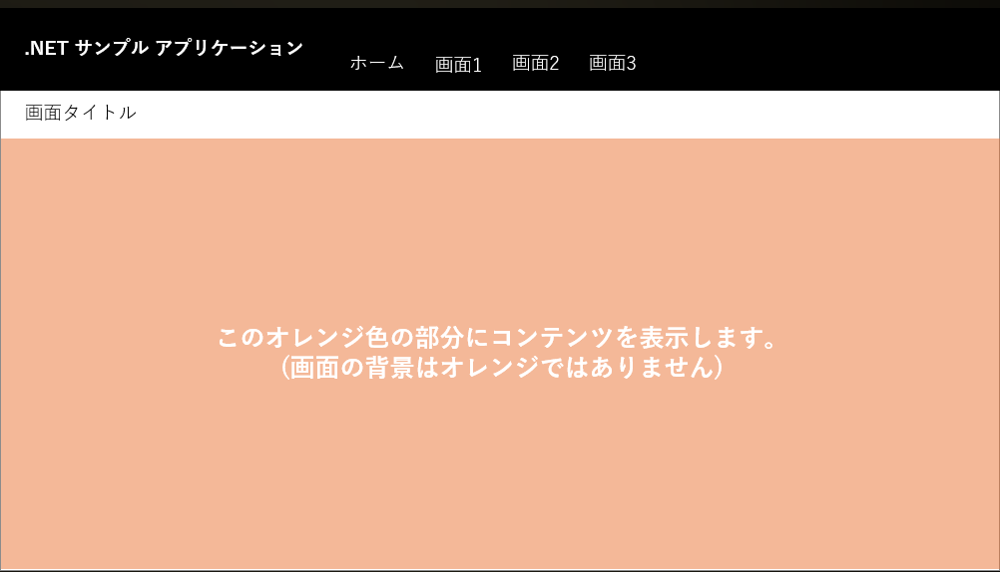

# 共通画面レイアウト定義

| 項目 | 内容 |
|------|------|
| 更新日 | 2026-02-22 |
| 名前 | Kazuki Ota |
| 版数 | 初版 |

---

本ドキュメントは、.NET サンプルアプリケーションの画面の共通定義を記載したものです。

本アプリケーションの画面は、例外を除きこの画面レイアウトに従う必要があります。

## 1. 画面レイアウト

画面ヘッダー部にアプリケーション名と、各ページへのリンクを配置します。

ヘッダー部の下にはページ名を表示して、その下にコンテンツ領域を配置します。コンテンツ領域内は画面ごとに自由にレイアウト可能です。以下のような見た目になります。

